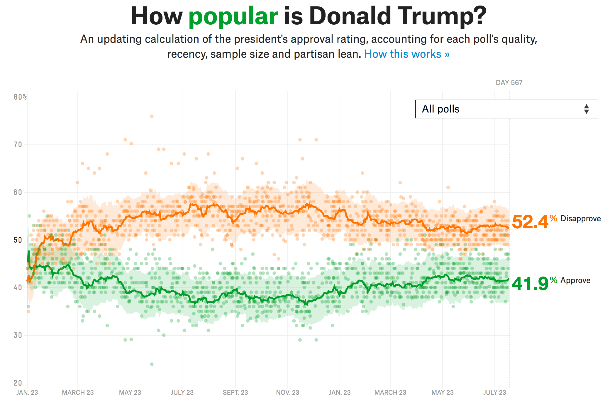

<!-- README.md is generated from README.Rmd. Please edit that file -->

# fivethirtyeight-approval

This repository shows how to recreate
[FiveThirtyEight’s](https://fivethirtyeight.com) Presidential approval
ratings graphic. For comparison, see the original image at the bottom of
this page.

## 1\. Import the data

Download the [data from
FiveThirtyEight](https://data.fivethirtyeight.com/).

``` r
## read data
a <- readr::read_csv("https://projects.fivethirtyeight.com/trump-approval-data/approval_polllist.csv")

## topline data
#tl <- readr::read_csv("https://projects.fivethirtyeight.com/trump-approval-data/approval_topline.csv")
```

## 2\. Wrangle the data

Do some minimal data wrangling

``` r
## convert date strings to date objects
a$modeldate <- lubridate::mdy(a$modeldate)
a$startdate <- lubridate::mdy(a$startdate)
a$enddate <- lubridate::mdy(a$enddate)
a$createddate <- lubridate::mdy(a$createddate)
```

## 3\. Analyze the data

Now aggregate and weight the approval estimates.

``` r
## aggregate by day, using weighted estimates
modest <- a %>%
  dplyr::select(enddate, adjusted_approve, adjusted_disapprove, weight) %>%
  tidyr::gather(var, est, -enddate, -weight) %>%
  dplyr::group_by(enddate, var) %>%
  dplyr::summarise(est = mean(est * weight, trim = .1) / mean(weight, trim = .1)) %>%
  dplyr::ungroup()
```

## 4\. Visualize the data

Finally, plot approve and disapprove estimates over time.

``` r
## plot all poll points and use aggregated estimates for smoothed line
a %>%
  dplyr::select(enddate, adjusted_approve, adjusted_disapprove) %>%
  tidyr::gather(var, est, -enddate) %>%
  ggplot(aes(x = enddate, y = est, colour = var, fill = var)) +
  geom_point(alpha = .15, size = 2) + 
  stat_smooth(data = modest, alpha = .15, method = "loess", 
    span = 0.0275, level = .9999, colour = "transparent") + 
  stat_smooth(se = FALSE, method = "loess", span = 0.00975, 
    level = .99999999, size = 1.5) + 
  scale_fill_manual(values = c(adjusted_approve = "#009f29", 
    adjusted_disapprove = "#ff7400")) + 
  scale_color_manual(values = c(adjusted_approve = "#009f29", 
    adjusted_disapprove = "#ff7400")) + 
  tfse::theme_mwk(base_family = "Roboto", light = "white", base_size = 28) + 
  theme(legend.position = "none", panel.grid.minor = element_blank(), 
    plot.subtitle = element_text(size = 20)) + 
  labs(x = NULL, y = NULL,
    title = "How popular is Donald Trump?", 
    subtitle = paste0("An updating calculation of the president's approval ", 
      "rating, accounting for each poll's quality, recency, sample size and ", 
      "partisan lean. How it works")) + 
  scale_x_date(breaks = seq(as.Date("2017-01-23"), max(a$enddate), "2 months"), 
    date_labels = "%b. %e") + 
  scale_y_continuous(breaks = seq(20, 80, 10), limits = c(20, 80)) + 
  ggsave("polls-538.png")
```

<p style="align:center">


### Original

<p style="align:center">


